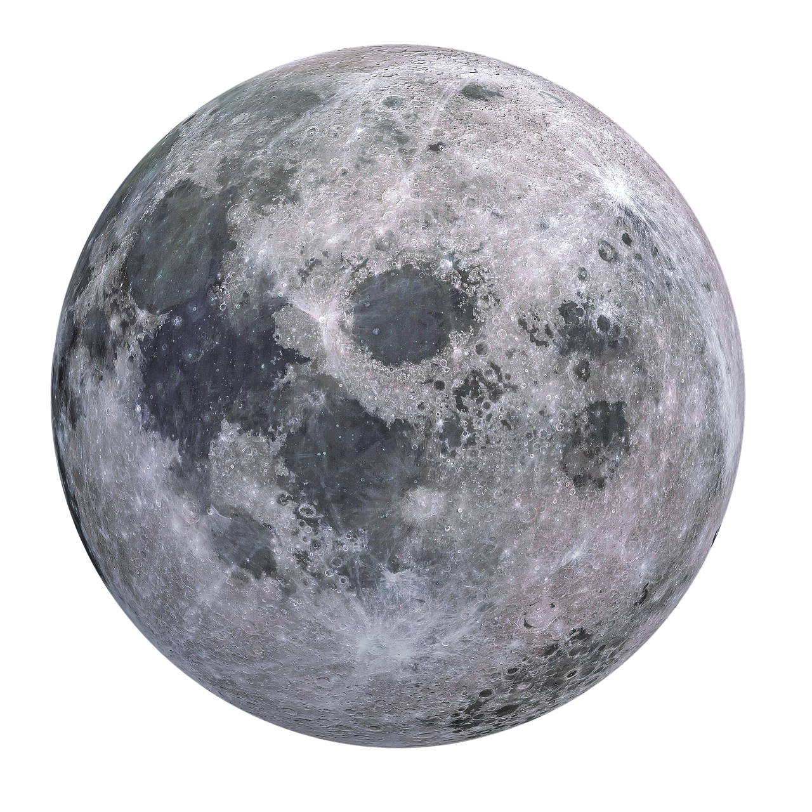

# Lune

La lune est le seul satellites de la terre.

Icone créée par [monkik](https://www.flaticon.com/authors/monkik) trouvée sur [flaticon](https://www.flaticon.com/).

## Caractéristiques

- Masse : 7.346 x 1022 kg
- Diamètre : 3472 km
- Distance au soleil :
  - Aphélie : 406 300 km
  - Demi-grand axe : 384 399 km
- Symbole : &#x263D;
