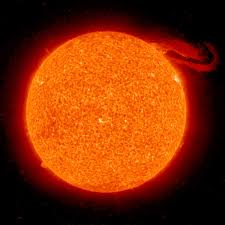

# soleil

 trouvée sur https://www.google.com/imgres?imgurl=https%3A%2F%2Fupload.wikimedia.org%2Fwikipedia%2Fcommons%2F4%2F42%2FSolar_prominence_from_STEREO_spacecraft_September_29%252C_2008.jpg&imgrefurl=https%3A%2F%2Ffr.wikipedia.org%2Fwiki%2FSoleil&tbnid=ZDk0jHrhUWl6PM&vet=12ahUKEwjP0paHj4fvAhUG8xoKHVasAd8QMygAegUIARCnAQ..i&docid=UwqVOIR0NZJ21M&w=2400&h=2400&q=soleil&client=firefox-b-d&ved=2ahUKEwjP0paHj4fvAhUG8xoKHVasAd8QMygAegUIARCnAQ

## Caractéristiques

- Masse : 3.301 x 1030 kg
- Diamètre : 1 392 684 km
- Symbole : &#x263C;